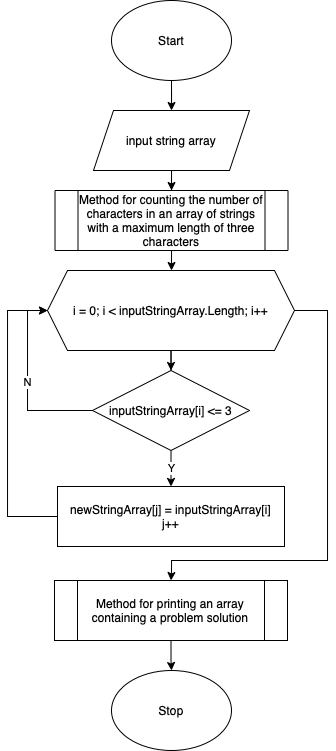

# Итоговая работа № 1
## По результатам прохождения блока "Разработчик" на образовательной платформе GeekBrains

## 1. Задание
---
1. Создать репозиторий на GitHub.
2. Нарисовать блок-схему алгоритма (моно обойтись блок-схемой основной содержательной части, если вы выделяете ее в отдельный метод).
3. Снабдить репозиторий оформленным текстовым описанием решения.(**README.md**)
4. Написать программу, решающую поставленную задачу.
5. Использовать контроль версий в работе над этим небольшим проектом (не должно быть все залито одним коммитом, как минимум этапы 2, 3, и 4 должны быть расположены в разных коммитах).

**Задача:**
*Написать программу, которая из имеющегося массива строк формирует массив из строк, длина которых меньше либо равна трех символов. Первоначальный массив можно ввести с клавиатуры, либо задать на старте выполнения алгоритма. При решении не рекомендуется пользоваться коллекциями, лучше обойтись исключительно массивами.*

---

## 2. Блок-схема, демонстрирующая алгоритм выполнения программы

## 3. Описание алгоритма программы

3.1 Программа выполняется с помощью обращения к трем методам:
* Метод, который вычисляет количество строк с длинной меньше или равной 3 в исходном массиве строк;
* Метод, создающий новый массив строк, длина которых не больше 3;
* Метод вывода полученного массива на экран.
3.2 Методом вычисления количества строк с длиной меньше или равной 3 вычисляем данное количество в исходном массиве.
3.3 Создаем новый массив с длиной равной, количеству из пункта 3.1.
3.4 В полученный массив записываем строки с длиной меньше или равной 3.
3.5 Выводим полученный массив строк на экран. 